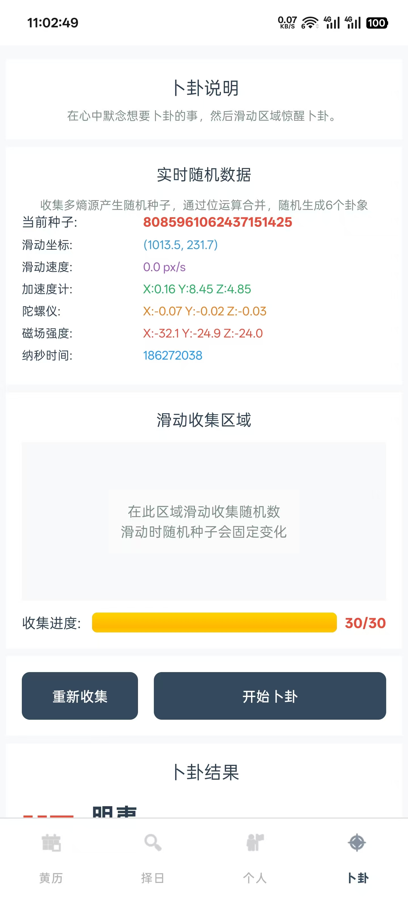

# 电子黄历 (Electronic Huangli)

[](https://android-arsenal.com/api?level=31)
[](LICENSE)
[](https://www.oracle.com/java/)

一个功能丰富的Android黄历应用，提供传统黄历查询、方位指南针、择日功能、个人运势分析和易经卜卦。

## 📱 功能特色

### 🧭 智能指南针
- **实时方位显示**：基于传感器的精确指南针功能
- **三神方位指引**：实时显示财神、喜神、福神方位
- **动态指针**：平滑的方位指针动画效果
- **方向校准**：自动校准设备方向，减少抖动

### 📅 传统黄历
- **每日黄历**：完整的农历日期和干支信息
- **宜忌提醒**：详细的今日宜做和忌做事项
- **节气信息**：二十四节气和传统节日显示
- **生肖运势**：当日生肖信息和运势提示
- **五行时辰**：五行属性和时辰吉凶分析

### 🔮 易经卜卦
- **真随机数生成**：结合多种硬件熵源(触摸、传感器、系统时间)
- **实时随机展示**：可视化显示随机数据收集过程
- **传统64卦体系**：完整的六十四卦易经体系
- **现代化解释**：传统卦辞配合现代运势解析
- **多维分析**：事业、财运、感情、健康全方位运势分析

### 🗓️ 择日功能
- **多事件类型**：支持结婚嫁娶、搬家入宅、开业开市等9种常见事件
- **灵活时间范围**：可选择7-90天的查询范围
- **智能筛选**：基于传统黄历理论的智能日期推荐

### 👤 个人运势
- **生辰设置**：支持详细的出生日期和时辰设置
- **个性化运势**：基于个人生辰的运势分析
- **生肖配对**：十二生肖相性分析和配对建议
- **五行相配**：个人五行与当日五行的相配分析

### 📤 分享功能
- **截图分享**：一键生成精美的黄历信息图片
- **多平台支持**：支持分享到微信、QQ等主流平台

## 🔧 技术特点

### 架构设计
- **Fragment架构**：采用现代化的Fragment+BottomNavigation设计
- **模块化代码**：合理的包结构划分，易于维护和扩展
- **工具类封装**：统一的常量管理和工具类设计

### 核心技术
- **传感器集成**：加速度计+磁力计+陀螺仪实现精确方位计算
- **多源随机数生成**：结合硬件传感器、触摸交互、系统时间的密码级随机数
- **农历计算**：集成lunar-java库实现离线农历计算
- **Material Design 3**：遵循最新Material设计规范
- **数据持久化**：SharedPreferences存储用户个人设置

### 性能优化
- **异步处理**：后台线程处理复杂计算，保证UI流畅
- **内存优化**：合理的生命周期管理，避免内存泄漏
- **平滑动画**：优化的指针动画和页面切换效果

## 📦 依赖库

```gradle
dependencies {
    implementation 'androidx.appcompat:appcompat:1.6.1'
    implementation 'com.google.android.material:material:1.10.0'
    implementation 'androidx.activity:activity:1.8.0'
    implementation 'androidx.constraintlayout:constraintlayout:2.1.4'
    implementation 'androidx.swiperefreshlayout:swiperefreshlayout:1.1.0'
    
    // 农历和黄历计算
    implementation 'cn.6tail:lunar:1.7.4'
}
```

## 🚀 快速开始

### 环境要求
- Android Studio Giraffe | 2022.3.1+
- Android API Level 31+
- Java 11+

### 构建步骤

1. **克隆项目**
```bash
git clone https://github.com/trah01/Electronic-Huangli.git
cd Electronic-Huangli
```

2. **导入Android Studio**
- 使用Android Studio打开项目目录
- 等待Gradle同步完成

3. **构建运行**
```bash
./gradlew assembleDebug
```

### 权限说明

```xml
<!-- 传感器权限 -->
<uses-feature android:name="android.hardware.sensor.compass" android:required="true" />
<uses-permission android:name="android.permission.HIGH_SAMPLING_RATE_SENSORS" />
<!-- 网络权限（用于未来扩展） -->
<uses-permission android:name="android.permission.INTERNET" />
```

## 📱 应用截图

| 首页指南针 | 择日功能 | 卜卦功能 | 个人设置 |
|---|---|---|---|
|  |  |  |  |

## 🗂️ 项目结构

```
app/src/main/java/com/trah/electronichuangli/
├── constants/              # 常量定义
│   └── AppConstants.java
├── utils/                  # 工具类
│   ├── CompassUtils.java           # 指南针工具
│   ├── PersonalInfoUtils.java      # 个人信息工具  
│   ├── UIUtils.java                # UI工具
│   ├── TrueRandomGenerator.java    # 真随机数生成器
│   ├── DivinationUtils.java        # 卜卦算法工具
│   └── DivinationResult.java       # 卜卦结果模型
├── MainActivity.java               # 主Activity
├── HomeFragment.java               # 首页Fragment
├── AuspiciousFragment.java         # 择日Fragment
├── DivinationFragment.java         # 卜卦Fragment
├── PersonalFragment.java           # 个人Fragment
└── LunarHelper.java               # 农历计算助手
```

## 🔮 卜卦算法说明

### 随机数生成机制
1. **多源熵收集**：同时采集以下随机源
   - 用户触摸坐标和滑动速度
   - 加速度计三轴数据
   - 陀螺仪三轴数据
   - 磁场传感器三轴数据
   - 系统纳秒级时间戳
   - Android SecureRandom

2. **种子合并算法**：收集30个随机种子通过复杂位运算合并
3. **六爻生成**：使用合并种子生成6个随机数对应六爻
4. **卦象计算**：按传统易经算法转换为64卦之一

### 传统易经体系
- 完整64卦数据库(乾、坤、屯、蒙...)
- 传统卦辞和象辞
- 现代化运势解释
- 吉凶判断和建议

## 🤝 贡献指南

欢迎提交Issue和Pull Request！

1. Fork本项目
2. 创建功能分支 (`git checkout -b feature/AmazingFeature`)
3. 提交更改 (`git commit -m 'Add some AmazingFeature'`)
4. 推送到分支 (`git push origin feature/AmazingFeature`)
5. 开启Pull Request

## 📝 更新日志

### v1.1.0 (2025-08-27)
- ✨ 新增易经卜卦功能
- 🔮 多熵源真随机数生成
- 📊 实时随机数据可视化
- 🎯 完整64卦体系和现代解释

### v1.0.0 (2025-08-26)
- ✨ 首次发布
- 🧭 实现智能指南针功能
- 📅 完整黄历查询功能
- 🗓️ 智能择日功能
- 👤 个人运势分析
- 📤 分享功能

## ⚖️ 开源协议

本项目基于 [GPL V3.0 License](LICENSE) 开源协议。

## 👨‍💻 作者

**trah** - *项目创建者和主要开发者*

- GitHub: [@trah01](https://github.com/trah01)

## 🙏 致谢

- [6tail/lunar-java](https://github.com/6tail/lunar-java) - 提供农历和黄历计算支持
- [Material Design 3](https://m3.material.io/) - UI设计规范
- Android官方文档和示例代码

---

⭐ 如果这个项目对你有帮助，请给它一个Star！
